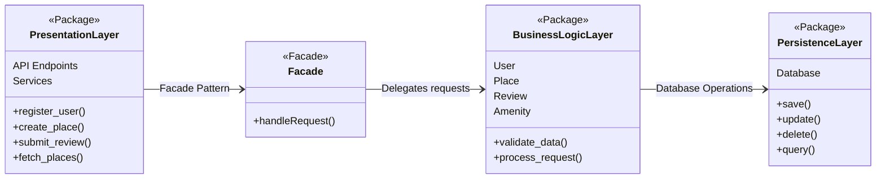

# Hbnb Evolution - Blueprint
**Project Overview**:
HBnB Evolution is an AirBnB-like application designed to facilitate user registration, property listings, reviews, and amenity management. The purpose of this document is to serve as a comprehensive technical blueprint, guiding the implementation phases of the project. It provides a clear reference for the system’s architecture and design, ensuring consistency and maintainability throughout development.

**Scope**:
This document covers the following key aspects:
    * **High-Level Architecture**: An overview of the system’s layered architecture and the use of the Facade pattern.
    * **Business Logic Layer**: Detailed class diagrams that model the core entities—User, Place, Review, and Amenity—and their interactions.
    * **API Interaction Flow**: Sequence diagrams illustrating the step-by-step process for key API calls (User Registration, Place Creation, Review Submission, and Fetching a List of Places).

---

## High-Level Package Diagram
### Diagram:

