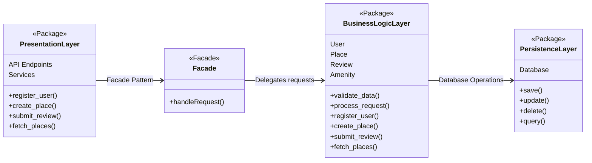
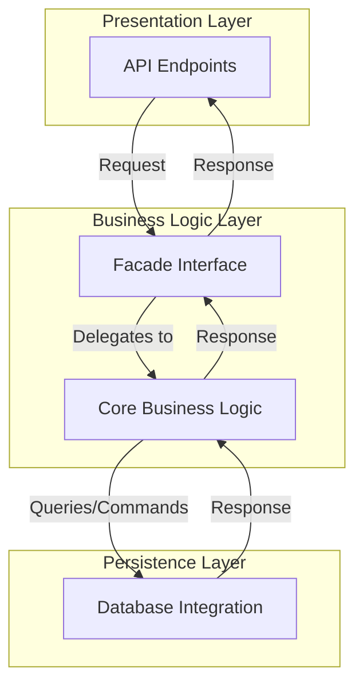
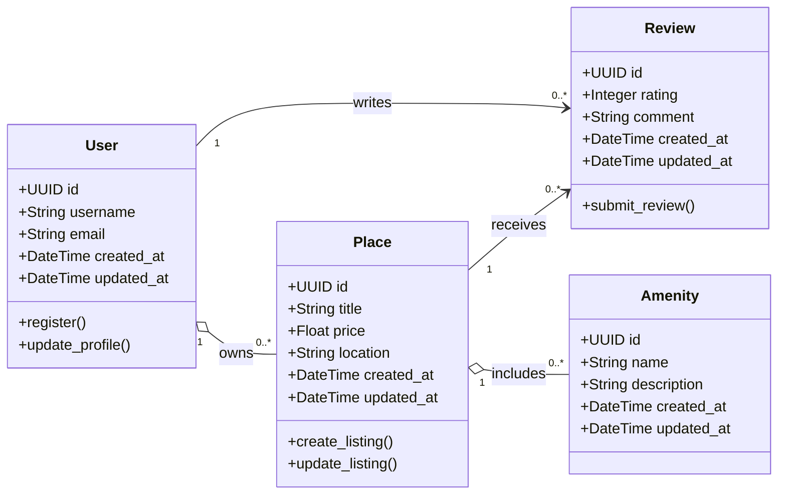

# Hbnb Evolution - Blueprint
**Project Overview**:
HBnB Evolution is an AirBnB-like application designed to facilitate user registration, property listings, reviews, and amenity management. The purpose of this document is to serve as a comprehensive technical blueprint, guiding the implementation phases of the project. It provides a clear reference for the system’s architecture and design, ensuring consistency and maintainability throughout development.

**Scope**:
This document covers the following key aspects:
* **High-Level Architecture**: An overview of the system’s layered architecture and the use of the Facade pattern.
* **Business Logic Layer**: Detailed class diagrams that model the core entities—User, Place, Review, and Amenity—and their interactions.
* **API Interaction Flow**: Sequence diagrams illustrating the step-by-step process for key API calls (User Registration, Place Creation, Review Submission, and Fetching a List of Places).

---

## High-Level Package Diagram
### [Diagram:](high_lvl_pkg_diag.md)

### Flow Chart

#### Explanatory Notes 
* **Presentation Layer**:
    * **Responsibilities**:
        * Exposes user-facing API endpoints.
        * Handles incoming HTTP requests, input validation, and response formatting.
    * **Components**:
        *API Endpoints: Entry points for actions like user registration and property listing.
    
* **Business Logic Layer**:
    * **Responsibilities**:
        * Implements core business rules and processes.
        * Acts as an intermediary between the Presentation and Persistence layers.
    * **Components**:
        * **Facade Interface**: Provides a simplified interface for the Presentation layer, encapsulating the complexity of the underlying logic.
        * **Core Business Logic**: Implements the processing, validation, and coordination of tasks.
    
* **Persistence Layer**:
    * **Responsibilities**:
        * Manages data storage and retrieval.
        * Abstracts the database operations (CRUD) from the business logic.
    * **Components**:
        * **Database Integration**: Handles interactions with the underlying data store.
    
* **Facade Pattern Benefits**:

    * **Simplification**: Provides a single entry point for interactions.
    * **Encapsulation**: Hides internal complexities and allows independent evolution of layers.
    * **Loose Coupling**: Decouples the Presentation Layer from direct knowledge of business and persistence details.

---

## Business Logic Layer - Detailed Class Diagram
### Diagram:

