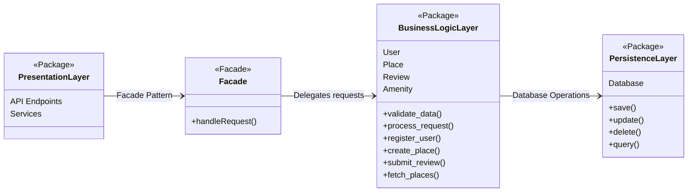

# Hbnb Evolution - Blueprint
**Project Overview**:
HBnB Evolution is an AirBnB-like application designed to facilitate user registration, property listings, reviews, and amenity management. The purpose of this document is to serve as a comprehensive technical blueprint, guiding the implementation phases of the project. It provides a clear reference for the system’s architecture and design, ensuring consistency and maintainability throughout development.

**Scope**:
This document covers the following key aspects:
    * **High-Level Architecture**: An overview of the system’s layered architecture and the use of the Facade pattern.
    * **Business Logic Layer**: Detailed class diagrams that model the core entities—User, Place, Review, and Amenity—and their interactions.
    * **API Interaction Flow**: Sequence diagrams illustrating the step-by-step process for key API calls (User Registration, Place Creation, Review Submission, and Fetching a List of Places).

---

## High-Level Package Diagram
### Diagram:

1. Presentation Layer

    * Responsibilities:
        * Exposes the API endpoints that the client applications interact with.
        * Handles HTTP requests, input validation, and response formatting.
        * Manages services like user registration, place creation, review submission, and retrieving places.
    * Key Components:
        * **API Endpoints & Services**: These provide the interface for client interactions (e.g., `register_user()`, `create_place()`).

2. **Facade Component**
    * **Role**:
        * Acts as an intermediary between the Presentation and Business Logic layers.
        * Simplifies the interface exposed to the Presentation layer.
        * Encapsulates the complexity of the underlying business logic by providing a unified method (e.g., `handleRequest()`).
    * **Benefits**:
        * Encapsulation: Hides internal implementation details.
        * Loose Coupling: Allows changes in business logic without impacting the presentation layer.
        * Simplified Communication: Provides a consistent entry point for all business operations.

3. **Business Logic Layer**
    * Responsibilities:
        * Implements the core business rules and processes.
        * Manages entities such as User, Place, Review, and Amenity.
        * Performs operations like data validation and processing of requests.
    * Key Operations:
        * `validate_data()` & `process_request()`: Ensures that business rules are correctly applied before interacting with the persistence layer.

4. **Persistence Layer**
    * Responsibilities:
        * Manages all interactions with the database.
        * Provides CRUD (Create, Read, Update, Delete) operations for all entities.
        * Abstracts the complexity of data storage from the business logic.
    * Key Operations:
        * `save()`, `update()`, `delete()`, `query()`: Handle the underlying database operations.