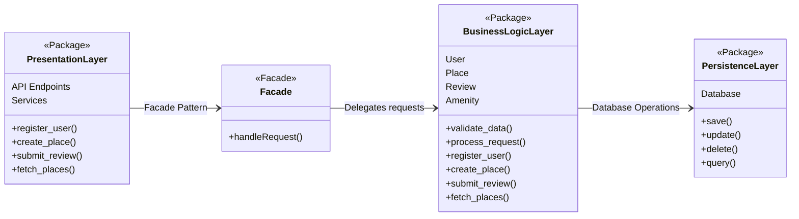
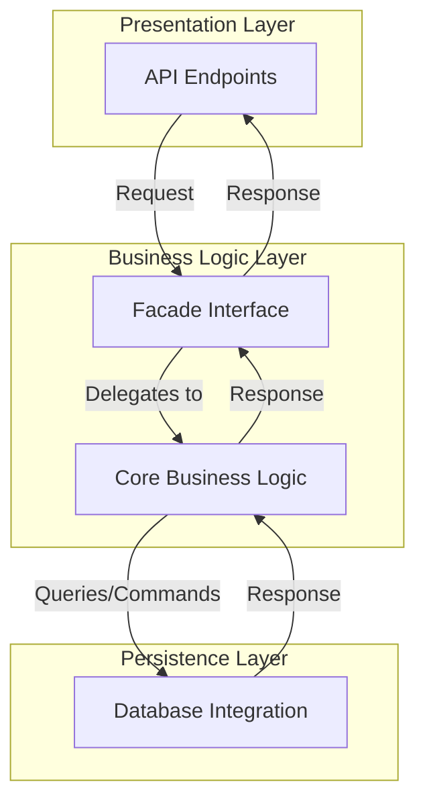
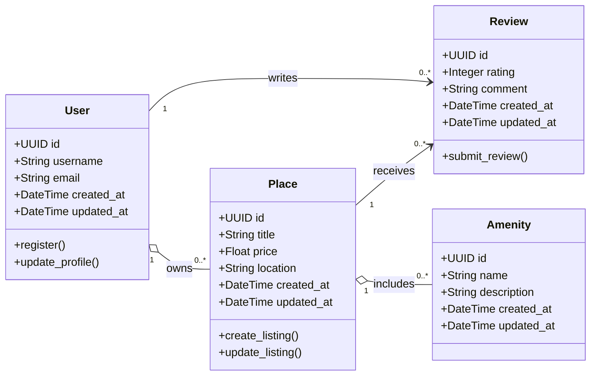
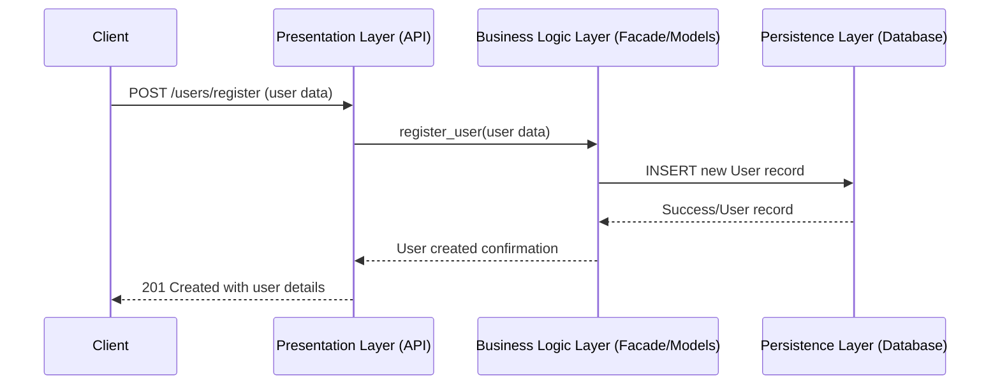
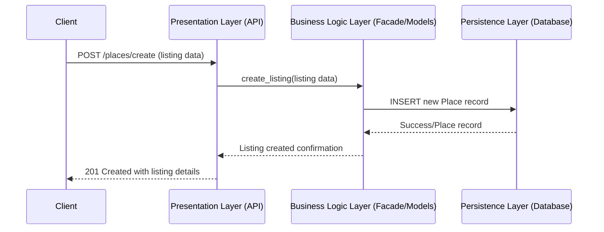
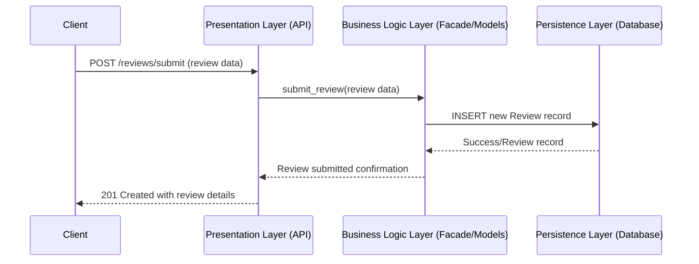
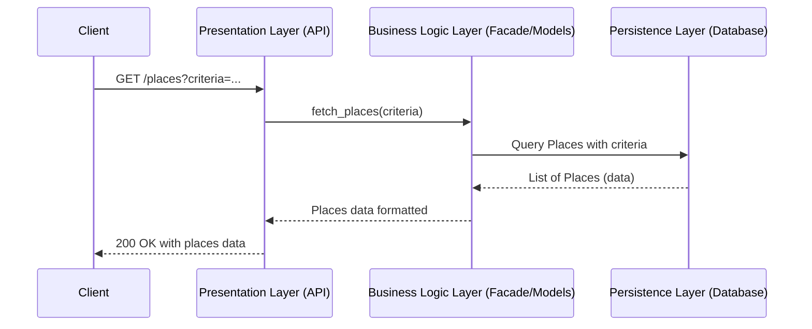

# Hbnb Evolution - Blueprint
**Project Overview**:
HBnB Evolution is an AirBnB-like application designed to facilitate user registration, property listings, reviews, and amenity management. The purpose of this document is to serve as a comprehensive technical blueprint, guiding the implementation phases of the project. It provides a clear reference for the system’s architecture and design, ensuring consistency and maintainability throughout development.

**Scope**:
This document covers the following key aspects:
* **High-Level Architecture**: An overview of the system’s layered architecture and the use of the Facade pattern.
* **Business Logic Layer**: Detailed class diagrams that model the core entities—User, Place, Review, and Amenity—and their interactions.
* **API Interaction Flow**: Sequence diagrams illustrating the step-by-step process for key API calls (User Registration, Place Creation, Review Submission, and Fetching a List of Places).

---

## High-Level Package Diagram
### [Diagram:](high_lvl_pkg_diag.md)

### Flow Chart:

#### Explanatory Notes 
* **Presentation Layer**:
    * **Responsibilities**:
        * Exposes user-facing API endpoints.
        * Handles incoming HTTP requests, input validation, and response formatting.
    * **Components**:
        * API Endpoints: Entry points for actions like user registration and property listing.
    
* **Business Logic Layer**:
    * **Responsibilities**:
        * Implements core business rules and processes.
        * Acts as an intermediary between the Presentation and Persistence layers.
    * **Components**:
        * **Facade Interface**: Provides a simplified interface for the Presentation layer, encapsulating the complexity of the underlying logic.
        * **Core Business Logic**: Implements the processing, validation, and coordination of tasks.
    
* **Persistence Layer**:
    * **Responsibilities**:
        * Manages data storage and retrieval.
        * Abstracts the database operations (CRUD) from the business logic.
    * **Components**:
        * **Database Integration**: Handles interactions with the underlying data store.
    
* **Facade Pattern Benefits**:

    * **Simplification**: Provides a single entry point for interactions.
    * **Encapsulation**: Hides internal complexities and allows independent evolution of layers.
    * **Loose Coupling**: Decouples the Presentation Layer from direct knowledge of business and persistence details.

---

## Business Logic Layer - Detailed Class Diagram
### Diagram:

### Explanatory Notes
1. **User**:
    * **Role**: Represents an individual interacting with the application.
    * **Attributes**:
        * `id`, `username`, `email`, and timestamps for creation and updates.
    * **Methods**:
        * `register()`: Registers a new user.
        * `update_profile()`: Allows updating user details.
    * **Relationships**:
        * **Owns Places**: A user can own (or list) multiple properties.
        * **Writes Reviews**: A user can write reviews for multiple locations

2. **Place**:
    * **Role**: Represents a property listing.
    * **Attributes**:
        * `id`, `title`, `price`, `location`, and timestamps.
    * **Methods**:
        `create_listing()`: Creates a new property listing.
        `update_listing()`: Updates listing details.
    * **Relationships**:
        * **Owned by User**: A place is owend by one user.
        * **Receives Reviews**: A place can have multiple reviewes.
        * **Includes Amenities**: A place aggregates multiple amenities.

3. **Amenity**:
    * **Role**: Represents a feature or service associated with a property.
    * **Attributes**:
        * `id`, `name`, `description`, and timestamps.
    * **Relationship**:
        * **Included** in **Place**: an amenity is associated with one or mor places.

4. **Review**
    * **Role**: Captures feedback for a property.
    * **Attributes**:
        * `id`, `rating`, `comment`, and timestamps.
    * **Method**:
        * `submit_review()`: Processes the submission of a review.
    * **Relationships**:
        * **Written** by **User**: each review is written by a user.
        * **Associated** with **Place**: Reviewes are linked to the place being reviewed.

---

## API Interaction Flow - Sequence Diagrams
### User Registration:

#### Explanatory Notes:
* **Flow**:
    1. The client sends a registration request with user data.
    2. The API validates and forwards the request to the Business Logic Layer.
    3. The Business Logic Layer processes the registration and interacts with the Persistence Layer to save the user.
    4. Once the database operation succeeds, a confirmation is sent back through the layers to the client.

### Place Creation:

#### Explanatory Notes:
* **Flow**:
    1. A client sends a request to create a new property listing.
    2. The API passes the listing data to the Business Logic Layer.
    3. The Business Logic Layer applies business rules and communicates with the Persistence Layer to store the listing.
    4. A confirmation is then returned to the client.

### Review Submission:

#### Explanatory Notes:
* **Flow**:
    1. The client initiates a review submission with relevant review data.
    2. The API handles the request and forwards it to the Business Logic Layer.
    3. The Business Logic Layer processes and records the review via the Persistence Layer.
    4. A confirmation is sent back to the client.

### Fetching a List of Places:

#### Explanatory Notes:
* **Flow**:
    1. The client requests a list of places by specifying search criteria.
    2. The API receives the request and delegates it to the Business Logic Layer.
    3. The Business Logic Layer queries the database for matching records.
    4. Retrieved data is formatted and sent back to the client as a response.
