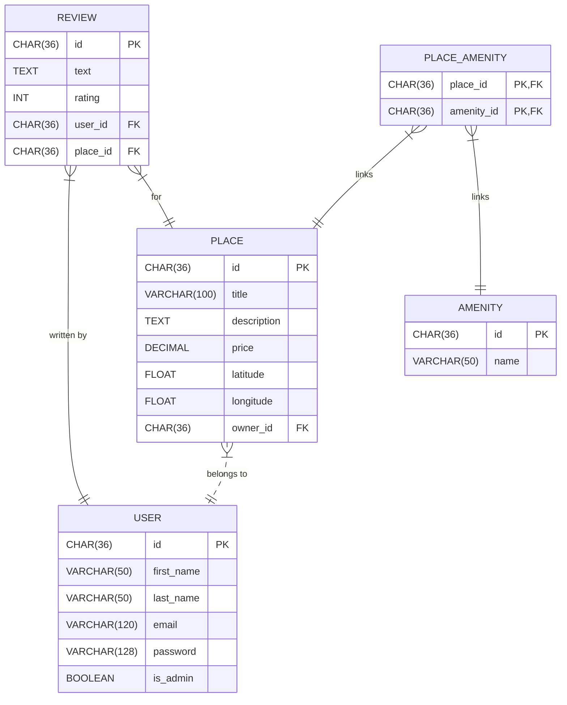

# Hbnb - Evolution

This project is a simple Airbnb-like clone built using Python and Flask. In this version, the application has been restructured to clearly separate the presentation, business logic, and persistence layers. A new database schema has been implemented using SQLAlchemy (with SQLite for development and migration-ready for production RDBMS such as MySQL).

## Project Structure

- **app/**: Contains the core application code.
  - **api/**: Houses the API endpoints, organized by version (v1/).
    - **v1/**
      - **users.py**: API endpoints for user-related operations.
      - **places.py**: API endpoints for place-related operations.
      - **reviews.py**: API endpoints for review-related operations.
      - **amenities.py**: API endpoints for amenity-related operations.
      - **auth.py**: Handles JWT-based authentication.
      - **protected.py**: Endpoints protected by authentication.
      - **admin.py**: Administrative endpoints.
  - **models/**: Contains the business logic classes.
    - **user.py**: Defines the User model.
    - **place.py**: Defines the Place model.
    - **review.py**: Defines the Review model.
    - **amenity.py**: Defines the Amenity model.
  - **services/**: Implements the Facade pattern, managing interactions between layers.
    - **facade.py**: Contains the HBnBFacade class with CRUD operations for Users, Places, Reviews, and Amenities.
  - **persistence/**: Implements data persistence.
    - **repository.py**: Defines repository classes (using SQLAlchemy in this version).
- **tests/**: Contains unittests for the application.
- **config.py**: Configures environment variables and application settings.
- **run.py**: Entry point for running the Flask application.
- **requirements.txt**: Lists all the Python packages needed for the project.
- **README.md**: This file, providing an overview of the project.

## Business Logic Layer

The Business Logic Layer defines the core entities:

- **User**: Represents a user with attributes like first name, last name, email, password, and admin status.
- **Place**: Represents a property listing with attributes such as title, description, price, location, and owner.
- **Review**: Represents feedback on a place, including a text review and rating.
- **Amenity**: Represents a feature (e.g., WiFi) offered at a property.

### Examples

#### Creating a User

```python
from app.models.user import User

user = User(first_name="John", last_name="Doe", email="john.doe@example.com")
print(user.first_name)  # Output: John
```

#### Creating a Place

```python
from app.models.place import Place

place = Place(
    title="Cozy Cottage",
    description="A cozy cottage in the countryside.",
    price=100.0,
    latitude=34.0522,
    longitude=-118.2437,
    owner="John Doe"
)
print(place.title)  # Output: Cozy Cottage
```

#### Creating a Review

```python
from app.models.review import Review
from app.models.place import Place
from app.models.user import User

user = User(first_name="John", last_name="Doe", email="john.doe@example.com")
place = Place(
    title="Cozy Cottage",
    description="A cozy cottage in the countryside.",
    price=100.0,
    latitude=34.0522,
    longitude=-118.2437,
    owner="John Doe"
)
review = Review(text="Great place to stay!", rating=5, place=place, user=user)
print(review.text)  # Output: Great place to stay!
```

#### Creating an Amenity

```python
from app.models.amenity import Amenity

amenity = Amenity(name="WiFi")
print(amenity.name)  # Output: WiFi
```

## Database Schema

The database schema has been redesigned for proper persistence. Key tables include:

- **users**: Stores user records with columns for `id`, `first_name`, `last_name`, `email`, `password`, and `is_admin`.
- **places**: Stores property listings with columns for `id`, `title`, `description`, `price`, `latitude`, `longitude`, and `owner_id` (foreign key to `users`).
- **reviews**: Stores reviews with columns for `id`, `text`, `rating`, `user_id` (foreign key to `users`), and `place_id` (foreign key to `places`).
- **amenities**: Stores amenities with columns for `id` and `name`.
- **place_amenities**: A many-to-many association table linking places and amenities.

### Entity-Relationship diagram


--
For the complete schema, refer to [hbnb_database.sql](part3/hbnb/hbnb_database.sql)

## Installation and Running the Application

### Prerequisites

- Python 3.6+
- pip (Python package installer)

### Installation

1. Clone the repository:
   ```
   sh
   git clone <repository-url>
   cd hbnb
   ```
2. Create a virtual environment:
   ```
   python3 -m venv .venv
   source .venv/bin/activate
   ```
3. Install dependencies:
   ```
   pip install -r requirements.txt
   ```

### Running the Application

1. Optionally set environment variables:
   ```
   export FLASK_ENV=development
   export SECRET_KEY='your_secret_key'
   ```
   * **Note**: Avoid embedding credentials in source code in production.

2. Run the Flask application:
   ```python run.py```
3. The application will be available on a local server.

### Running Unit Tests

To run unit tests, update your PYTHONPATH from the command line:
```
export PYTHONPATH=$(pwd)
```
Then run the tests using a runner like `pytest`:
```
pytest
```

---
